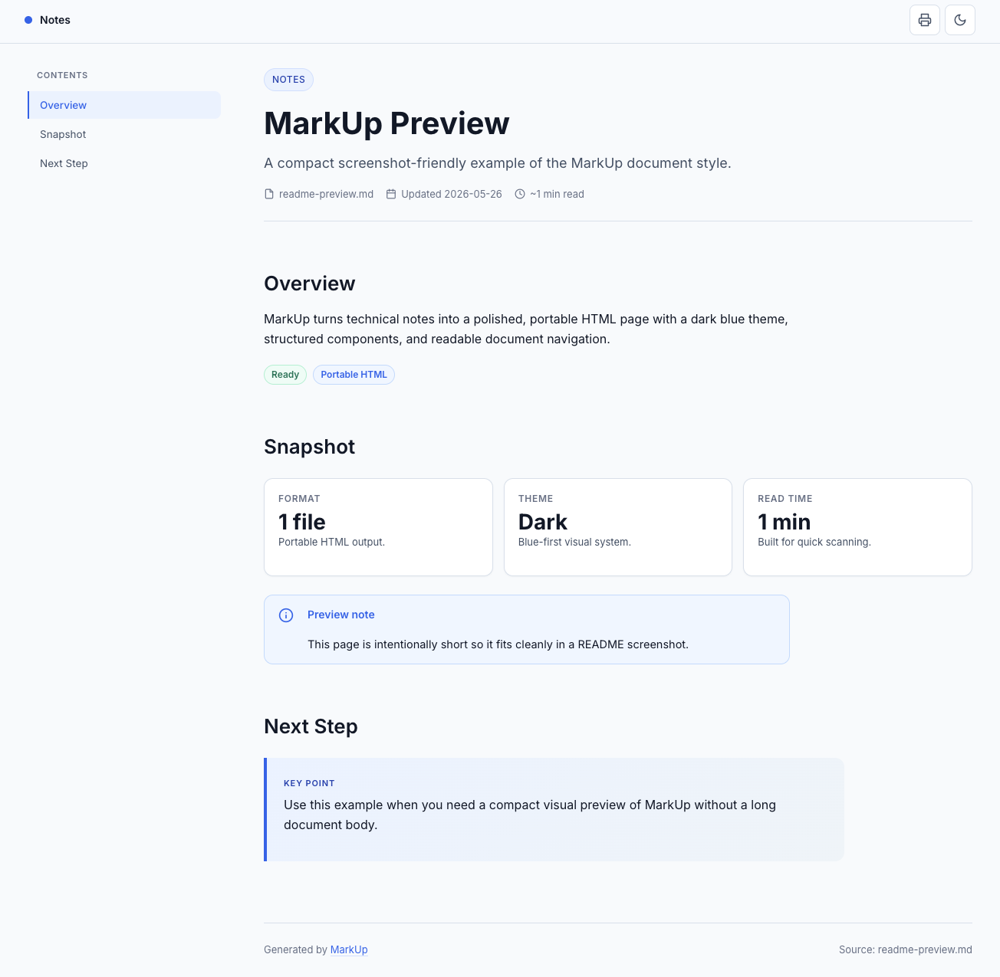
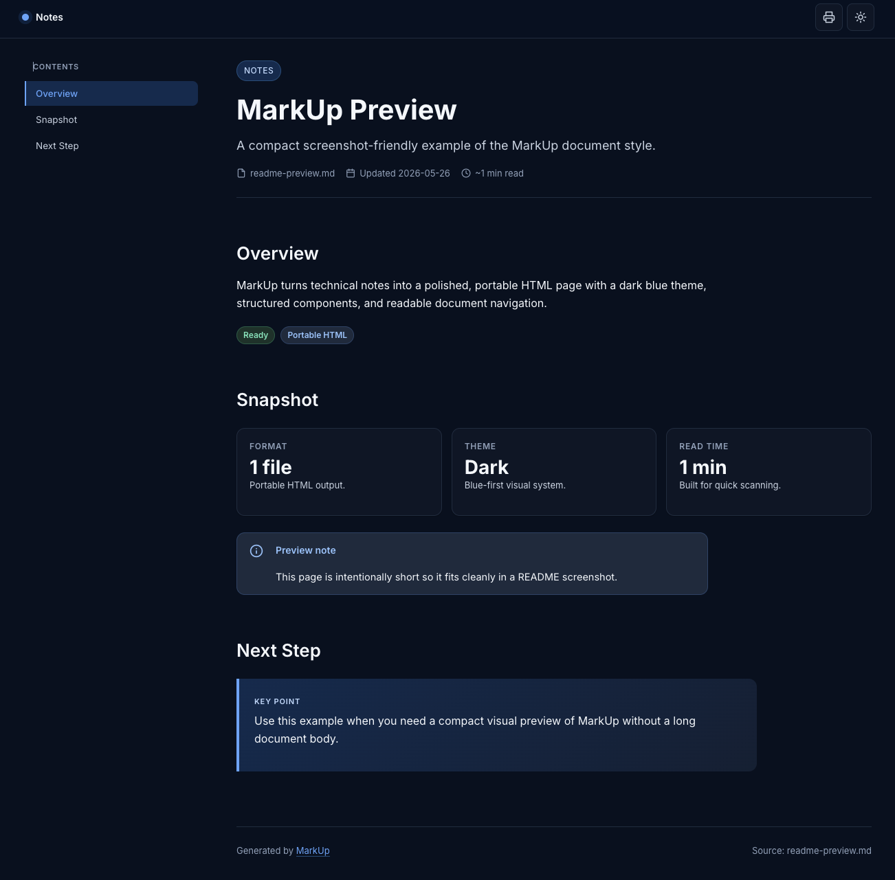

# md2html

> **Your AI writes docs. md2html turns them into pages people actually read.**
> A portable skill for Claude Code, Codex, Antigravity — or any AI agent — that turns long-form Markdown (plans, specs, system designs, RFCs, runbooks, postmortems, brainstorms, notes) into a single self-contained HTML page with sidebar TOC, Mermaid diagrams, step timelines, callouts, comparison cards, and a light/dark Claude-orange theme.

[](LICENSE)
[](#install)
[](#install)
[](#multi-language)

<p align="center">
  
  
</p>

## The problem

Your AI just produced 2,000 words of system design. Beautiful logic, careful tradeoffs, three architecture options compared — and you can't bring yourself to read past section 2 because it's a monospace wall of text in a terminal scrollback. Same goes for the brainstorm doc you asked it for last week, the migration plan from this morning, the postmortem draft you've been ignoring. Nobody on the team will click your `plan.md` link either.

## What this skill does

You type `/md2html anydoc.md`. Your agent reads the file, opens `template.html` + `components.md` from this repo, and writes one polished HTML file next to the source. No build step, no server, no Node, no Python.

Works on anything long-form your AI hands you:

- **Plans** — multi-week roadmaps, migration steps, rollout strategies
- **Specs** — feature specs, API specs, data-model designs
- **System designs** — architecture docs, RFC-style proposals
- **Runbooks** — operational procedures, incident response steps
- **Postmortems** — incident reviews with timeline + root cause + action items
- **Brainstorms** — option lists with rationale, idea dumps to organize
- **Notes** — meeting notes, research summaries, anything else markdown

It's not a Markdown-to-HTML converter. **It's an analyzer.** The agent decides which sections become Mermaid diagrams, which become numbered step cards, which become pros-cons tables, which become collapsible "deep dive" panels. The result feels designed, not converted.

## Why it's worth your `~/.claude/skills` slot

- **Reads like a product page, not a spec.** Sidebar TOC with scroll-spy, anchor links on every heading, copy-to-clipboard on every code block, a scroll progress bar at the top. Things you'd build into a real docs site.
- **Diagrams instead of paragraphs.** Three-hop flows automatically become Mermaid `flowchart` blocks. Trade-off discussions become side-by-side comparison cards. The agent decides — you don't write any of it.
- **One file. Email it. Drop it in Slack. Open it on a plane.** Self-contained HTML with embedded CSS and theme JS. The only network request is the Mermaid CDN, and you can inline that too if you care.
- **Zero install for your users.** No `npm install`. No Docker. The whole skill is three markdown/HTML files. Anyone with an AI agent and `git clone` can use it in under a minute.
- **Portable across agents.** Works the same way in Claude Code, Codex CLI, Antigravity, Cursor, Continue.dev — anywhere an agent can read a file and write a file. No agent-specific code.
- **Source language → output language, automatically.** Vietnamese spec? Vietnamese UI. Chinese plan? `目录` instead of `Contents`. Eight languages built into the label table; the agent fills in any other language by translation.
- **Production-grade UX, not a weekend hack.** WCAG AA contrast, ≥ 40 px touch targets, `prefers-reduced-motion`, focus-visible rings, mobile TOC drawer with backdrop and ESC-to-close, skip-to-content link, full print stylesheet. Reviewed by a UI/UX engineer who didn't pull punches.

## Install

### Claude Code

```bash
git clone https://github.com/haidang1810/md2html ~/.claude/skills/md2html
```

Reload your session and run:

```
/md2html plan.md
```

→ outputs `plan.html` next to the source.

### Codex CLI

```bash
git clone https://github.com/haidang1810/md2html ~/.config/md2html
mkdir -p ~/.codex/prompts
ln -s ~/.config/md2html/SKILL.md ~/.codex/prompts/md2html.md
```

(Codex's prompts directory has shifted across versions — adjust the symlink target if needed.)

### Antigravity

```bash
git clone https://github.com/haidang1810/md2html ~/projects/md2html
```

Open Antigravity → **Settings → Custom Agents → New**, paste the contents of `SKILL.md`, and give the agent file-read access to `~/projects/md2html/`.

### Any other AI agent

If the agent supports a system prompt or custom instructions AND can read/write local files, it can run this skill. Clone the repo to a stable path, paste `SKILL.md` into the agent's custom instructions, done.

## Usage

```
/md2html plan.md                    # writes plan.html
/md2html plan.md --out docs/x.html  # custom output path
/md2html                            # prompts for a file
```

The agent picks components based on what's actually in the doc:

| What's in the Markdown                          | What you get                          |
| ---                                             | ---                                   |
| Numbered list of actions                        | Step cards with timeline rail         |
| "A calls B, B writes to DB" prose               | Mermaid `flowchart`                   |
| "Pros / Cons", "Trade-offs of X"                | Two-column pros-cons box              |
| "Option A vs B vs C"                            | Comparison cards (with ★ Recommended) |
| "Don't do X" / "Must do Y"                      | Danger / decision callout             |
| Long appendix or code dump                      | Collapsible deep-dive panel           |
| Key conclusion                                  | Accent-bordered highlight box         |

## Multi-language

UI labels follow the source. The label table covers **English, Vietnamese, Chinese (中文), Japanese (日本語), Korean (한국어), Spanish, French, German** out of the box. Anything else, the agent translates equivalently and sets `<html lang="...">` plus the `--rec-label` CSS variable. RTL languages are LTR-only for now.

## Demo

See [`examples/example-plan.md`](examples/example-plan.md) (Vietnamese source) → [`examples/example-plan.html`](examples/example-plan.html) (rendered). The screenshots at the top of this README are from a longer test spec — a game economy design doc.

## Customize the theme

All visual tokens are CSS variables at the top of `template.html`. Change accent color, surface, fonts, radii by editing the `:root` and `[data-theme="dark"]` blocks. Don't rename classes — `components.md` references them.

```css
:root {
  --accent: #D97757;    /* Claude orange — change me */
  --bg: #FAFAF7;
  /* … */
}
```

## Update

```bash
cd ~/.claude/skills/md2html && git pull
```

## Uninstall

```bash
rm -rf ~/.claude/skills/md2html
```

## What's in the box

```
md2html/
├── SKILL.md         # Instructions the agent loads on /md2html
├── template.html    # HTML skeleton: CSS + Mermaid + theme JS
├── components.md    # Component catalog the agent assembles from
├── examples/        # Reference .md → .html pair (gold standard)
├── docs/            # Screenshots for this README
├── LICENSE
└── README.md
```

## Roadmap

- [ ] Inline Mermaid bundle (true offline mode)
- [ ] More themes (forest green, midnight blue, paper)
- [ ] Gantt / roadmap component
- [ ] Auto-detect images in source and inline them
- [ ] RTL language support (Arabic, Hebrew)

PRs welcome — especially translation tables for additional languages and theme variants.

## License

[MIT](LICENSE) © 2026 [haidang1810](https://github.com/haidang1810)
